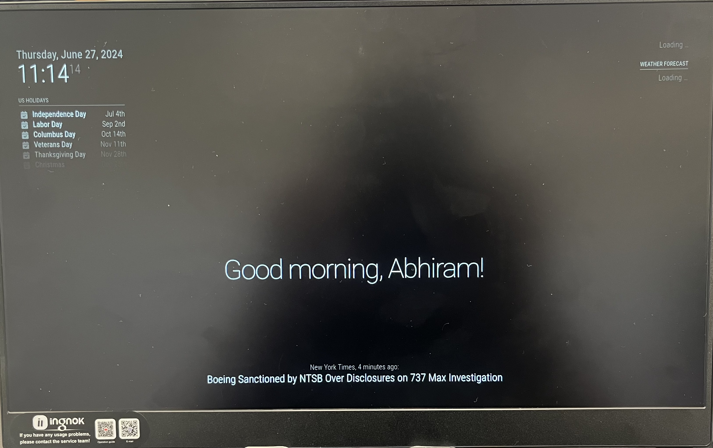
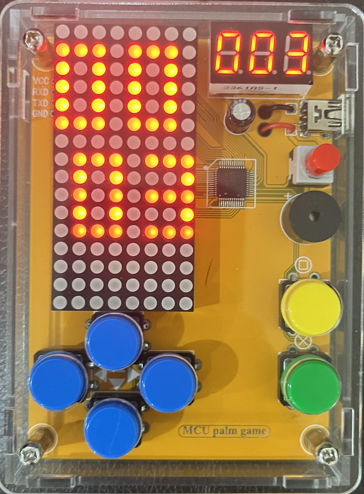

# Smart Mirror

The project that I chose to build is a Smart Mirror. It is a mirror that displays important details that are significant to a person's likes/dislikes, their job, or their overall life. Some details that it displays (but not included to) include time, personal calendar, weather, news, and supportive messages etc. 

To build the part of this project that displays the details such as time etc, some of the main components that I needed were a Raspberry Pi and the Magic Mirror OS. Along with that, I needed numerous power cords and HDMI cables to ensure that I could power my device and navigate within the Raspberry Pi. To build the hardware of this project, I needed transparaent acrylic, a 3D printed frame and numerous screws to hold everything in place together and to ensure that the project functioned as a mirror. 

<!---

Challenges:

Takeaways:

Triumphs:

-->


```HTML
```


| **Engineer** | **School** | **Area of Interest** | **Grade** |
|:--:|:--:|:--:|:--:|
| Abhiram B | Lynbrook High School | Data Science | Rising Senior


  
<!---

# Final Milestone

**Don't forget to replace the text below with the embedding for your milestone video. Go to Youtube, click Share -> Embed, and copy and paste the code to replace what's below.**

<iframe width="560" height="315" src="https://www.youtube.com/embed/F7M7imOVGug" title="YouTube video player" frameborder="0" allow="accelerometer; autoplay; clipboard-write; encrypted-media; gyroscope; picture-in-picture; web-share" allowfullscreen></iframe>

For your final milestone, explain the outcome of your project. Key details to include are:
- What you've accomplished since your previous milestone
- What your biggest challenges and triumphs were at BSE
- A summary of key topics you learned about
- What you hope to learn in the future after everything you've learned at BSE
-->


# Second Milestone

<iframe width="560" height="315" src="https://www.youtube.com/embed/CNW7RwygF0U?si=BVh0VHVyGYfxYdC2" title="YouTube video player" frameborder="0" allow="accelerometer; autoplay; clipboard-write; encrypted-media; gyroscope; picture-in-picture; web-share" referrerpolicy="strict-origin-when-cross-origin" allowfullscreen></iframe>


For my second milestone, I finished personalizing each module configuration that was originallly not programmed to show details that are personal to me, for example the calendar displayed US Holidays instead of events related to my life such as birthdays of my friends etc. Along with that, I also finished the schematics for my custom frame which I will be 3D printing and using in order to assemble my main project together. I used OnShape to build the schematics for my custom frame ad sent them over to the 3D printing team. 

Some challenges that I faced while trying to achieve the second milestone include figuring out how to use OnShpae since I never used it before. It took my sometime to get used to working with OnShape, but at the end I was able to figure it out. Another challenge that I had was trying to personalize my calendar while ensuring that all events in my calendar are private and are not publicly accessbile. It took me a long time to figure out how to sync my calendar into the magic mirror while ensuring that all events in my calendar remain private. 

Moving forward, I plan on putting together all the different components of this mirror in order to have one complete project and start working on the numeous modifications that I have in mind. These modifications would allow me to add numerous upgrades to my project and make it more useful and more user friendly. 

# First Milestone

<iframe width="560" height="315" src="https://www.youtube.com/embed/GqBjwivqg88?si=dJGUGrJaHk7Bg58I" title="YouTube video player" frameborder="0" allow="accelerometer; autoplay; clipboard-write; encrypted-media; gyroscope; picture-in-picture; web-share" referrerpolicy="strict-origin-when-cross-origin" allowfullscreen></iframe>




My main project is the Smart Mirror. Essentially, this project is similar to a iPad/tab that can be mounted on your wall and can be used as a mirror at the same time. This project would help the user view basic information like the time, weather, their calender events, and many other things catered to the personal interests of the user. For example, if the user is an investor, we could program the mirror to display stock prediction charts using stock predictive algorithms. 

The different components that were used in reaching the first milestone include the Raspberry Pi itself along with numerous cables that were connected to the Raspberry Pi which aided in the process of viewing what was happening (HDMI Cable) and control the Raspberry Pi (keyboard and mouse cables). Along with that, I also had to use numerous power cords to ensure that all devices that I was using had power. 

In terms of technical progress, I finished uploading the Magic Mirror OS onto my Raspberry Pi and finished modifying the module configurations. Module Configurations include modifying the alert system, the weather system, the calendar system etc. Some challenges that I faced while trying to attain my first milestone included modifying the alert system. While trying to modify the alert system in order to change the way that an alert is shown on the Magic Mirror, I ended up having a syntax error. I spent a lot of time trying to figure out which line of code had the syntax error because the GitBash only told me one error at a time, due to which the debugging process took longer. After spending about two hours, I decided to wipe the memory of the SD Card and restart everything, due to which I had a small delay in the overall building process. Apart from that, I had no other major issues in terms of trying to modify the module configurations and upload the Magic Mirror OS. 

Moving forward, I plan on 3D printing a custom frame to put my mirror into and personalize all the modules such as the calendar etc so that all the modules are used to help the user and make his/her life easier. 

# Starter Project

<iframe width="560" height="315" src="https://www.youtube.com/embed/yVzV0djj91M?si=bQ9mIbUsQVQZiGL1" title="YouTube video player" frameborder="0" allow="accelerometer; autoplay; clipboard-write; encrypted-media; gyroscope; picture-in-picture; web-share" referrerpolicy="strict-origin-when-cross-origin" allowfullscreen></iframe>




I built a Retro Arcade Gaming Console to perfect my soldering skills. I used the starter kit and soldered the buttons, the speaker, and a battery case that is used to power the device. I chose to build this product because growing up, I loved playing various video anda arcade games, and I was really excited to build this, due to which I chose this project. 

The Retro Arcade Gaming Console works with a chip that takes in the input from all the buttons and uses this input to change the LED output on the LED screen that has been installed onto the Console. Along with that, there is a speaker that produces music everytime the player does something good during the game, wins the game, or loses the game. A main challenge that I faced while trying to build this project was desoldering two parts that I soldered earlier, but I had to desolder them since instead of soldering them individually, I soldered them together. Soldering was not something that I picked up easily, due to which I spent a lot of time on trying to fix my soldering issue. Apart from that, I had no major issues trying to build this console. 

Moving forward, I will be building a Smart Mirror using Raspberry Pi and hope to add numerous modifications to it and make it useful in more than one way. 

<!---

# Schematics 
Here's where you'll put images of your schematics. [Tinkercad](https://www.tinkercad.com/blog/official-guide-to-tinkercad-circuits) and [Fritzing](https://fritzing.org/learning/) are both great resoruces to create professional schematic diagrams, though BSE recommends Tinkercad becuase it can be done easily and for free in the browser. 

# Code
Here's where you'll put your code. The syntax below places it into a block of code. Follow the guide [here]([url](https://www.markdownguide.org/extended-syntax/)) to learn how to customize it to your project needs. 

```c++
void setup() {
  // put your setup code here, to run once:
  Serial.begin(9600);
  Serial.println("Hello World!");
}

void loop() {
  // put your main code here, to run repeatedly:

}
```

-->


# Bill of Materials
Provided below is a bill of materials that contains the name, price, use, and a link for each individual component that was used in order to build the Smart Mirror

| **Part** | **Note** | **Price** | **Link** |
|:--:|:--:|:--:|:--:|
| Raspberry Pi 4 Kit (4GB- PSU, micro SD card, HDMI cable, SD card reader) | The item is used to upload the software onto the Magic Mirror | $119.99 | <a href="https://www.amazon.com/CanaKit-Raspberry-4GB-Starter-Kit/dp/B07V5JTMV9/ref=sr_1_6?crid=19B93GVV3GWJZ&dib=eyJ2IjoiMSJ9.OB0X7WOqDHVmnd2AYLgUwrutHruBmYtZFEWv_1XacEI7JVgm7OEBS7IjrEJ6ttYTW-hCyQUyYWIP3QiLiIWzbuXLjja9ptHDL4GkDxCOTIdK-f_2PTwGdqgxrmjdcNw_iYIE4KHxR5ry6tWB4UewwkOum7D0u37EVBWFfjI7YKiZvGgdeGO3725EFkpDggmGUpOWLQZOcFIQEMj_NU_vHRphmrNGxue9RyjOOi-PhXgSCvouKMsdnMM43ET0MpN1u5c6sLoodrCyh2VQl79Z6ULSLpknhNUYnQCRER29mAs.G1Sz2gzkqOcNO-VIO_Genmg6uQo1igVsaJQ_9jGih9w&dib_tag=se&keywords=raspberry%2Bpi%2B4%2Bkit&qid=1715368351&refinements=p_amazon_business_seller%3A15156999011&rnid=15156998011&s=electronics&sprefix=raspberry%2Bpi%2B4%2Bkit%2Celectronics%2C110&sr=1-6&th1"> Link to the Raspberry Pi 4 Kit </a> |
| Wireless USB Mouse and Keyboard | The item is used to navigate through the Raspberry Pi | $14.99 | <a href="https://www.amazon.com/CanaKit-Raspberry-4GB-Starter-Kit/dp/B07V5JTMV9/ref=sr_1_6?crid=19B93GVV3GWJZ&dib=eyJ2IjoiMSJ9.OB0X7WOqDHVmnd2AYLgUwrutHruBmYtZFEWv_1XacEI7JVgm7OEBS7IjrEJ6ttYTW-hCyQUyYWIP3QiLiIWzbuXLjja9ptHDL4GkDxCOTIdK-f_2PTwGdqgxrmjdcNw_iYIE4KHxR5ry6tWB4UewwkOum7D0u37EVBWFfjI7YKiZvGgdeGO3725EFkpDggmGUpOWLQZOcFIQEMj_NU_vHRphmrNGxue9RyjOOi-PhXgSCvouKMsdnMM43ET0MpN1u5c6sLoodrCyh2VQl79Z6ULSLpknhNUYnQCRER29mAs.G1Sz2gzkqOcNO-VIO_Genmg6uQo1igVsaJQ_9jGih9w&dib_tag=se&keywords=raspberry%2Bpi%2B4%2Bkit&qid=1715368351&refinements=p_amazon_business_seller%3A15156999011&rnid=15156998011&s=electronics&sprefix=raspberry%2Bpi%2B4%2Bkit%2Celectronics%2C110&sr=1-6&th=1)](https://www.amazon.com/Wireless-Keyboard-Ultra-Thin-Computer-Notebook/dp/B09KVCCYC1/ref=sr_1_8?crid=2J9QZQCJBHTSA&dib=eyJ2IjoiMSJ9.3H8RIV_grCNn42UxdCO2j6n9Q-44ekPZR25aoRMIEJThuExMqCxTsj9XZfg2ftG0Qf7v_VTvUMaL7T6FTWTK2Iex5n7mq5Kn-I3t8v3sEf8VBzwtMfdpuqCqUqMKCmdVOllvR3MNLHAniacjnv2E9Wfy7SM2vGEpSE5_FBY0SZGZtRRTvOcSW5lo_ia0Ta6a7kmb3eBBAjhBf6e5OacaB5JPv8DUy4iNb8boSM_CjW20CtNWWKPON1i3yBCYM76z_pYztayL2I8-m6-Ev26B0_zlbM1C3U_YMCchYtZzl9A.dLgHQH3znbvqfbvOGN3L4ckKEiEOGZQYHllR_3WAO1c&dib_tag=se&keywords=mini%2Bkeyboard%2Band%2Bmouse&qid=1715911949&s=electronics&sprefix=mini%2Bkeybaord%2Band%2Bmouse%2Celectronics%2C100&sr=1-8&th=1"> Link to the Wireless USB Mouse and Keyboard </a> |
| 15.6" Monitor (8.66x13.78") | The item is used to display all the modules that were coded for in the Raspberry Pi OS | $81.99 | <a href="https://www.amazon.com/CanaKit-Raspberry-4GB-Starter-Kit/dp/B07V5JTMV9/ref=sr_1_6?crid=19B93GVV3GWJZ&dib=eyJ2IjoiMSJ9.OB0X7WOqDHVmnd2AYLgUwrutHruBmYtZFEWv_1XacEI7JVgm7OEBS7IjrEJ6ttYTW-hCyQUyYWIP3QiLiIWzbuXLjja9ptHDL4GkDxCOTIdK-f_2PTwGdqgxrmjdcNw_iYIE4KHxR5ry6tWB4UewwkOum7D0u37EVBWFfjI7YKiZvGgdeGO3725EFkpDggmGUpOWLQZOcFIQEMj_NU_vHRphmrNGxue9RyjOOi-PhXgSCvouKMsdnMM43ET0MpN1u5c6sLoodrCyh2VQl79Z6ULSLpknhNUYnQCRER29mAs.G1Sz2gzkqOcNO-VIO_Genmg6uQo1igVsaJQ_9jGih9w&dib_tag=se&keywords=raspberry%2Bpi%2B4%2Bkit&qid=1715368351&refinements=p_amazon_business_seller%3A15156999011&rnid=15156998011&s=electronics&sprefix=raspberry%2Bpi%2B4%2Bkit%2Celectronics%2C110&sr=1-6&th=1)](https://www.amazon.com/Wireless-Keyboard-Ultra-Thin-Computer-Notebook/dp/B09KVCCYC1/ref=sr_1_8?crid=2J9QZQCJBHTSA&dib=eyJ2IjoiMSJ9.3H8RIV_grCNn42UxdCO2j6n9Q-44ekPZR25aoRMIEJThuExMqCxTsj9XZfg2ftG0Qf7v_VTvUMaL7T6FTWTK2Iex5n7mq5Kn-I3t8v3sEf8VBzwtMfdpuqCqUqMKCmdVOllvR3MNLHAniacjnv2E9Wfy7SM2vGEpSE5_FBY0SZGZtRRTvOcSW5lo_ia0Ta6a7kmb3eBBAjhBf6e5OacaB5JPv8DUy4iNb8boSM_CjW20CtNWWKPON1i3yBCYM76z_pYztayL2I8-m6-Ev26B0_zlbM1C3U_YMCchYtZzl9A.dLgHQH3znbvqfbvOGN3L4ckKEiEOGZQYHllR_3WAO1c&dib_tag=se&keywords=mini%2Bkeyboard%2Band%2Bmouse&qid=1715911949&s=electronics&sprefix=mini%2Bkeybaord%2Band%2Bmouse%2Celectronics%2C100&sr=1-8&th=1](https://www.amazon.com/Ingnok-15-6-FHD-Portable-Monitor/dp/B0CP7XRW9S/ref=cm_cr_arp_d_product_top?ie=UTF8&th=1"> Link to the Monitor </a> |
| 90 deg HDMI adapter | The item is used to connect the Raspberry Pi to the Monitor | $9.18 | <a href="https://www.amazon.com/CanaKit-Raspberry-4GB-Starter-Kit/dp/B07V5JTMV9/ref=sr_1_6?crid=19B93GVV3GWJZ&dib=eyJ2IjoiMSJ9.OB0X7WOqDHVmnd2AYLgUwrutHruBmYtZFEWv_1XacEI7JVgm7OEBS7IjrEJ6ttYTW-hCyQUyYWIP3QiLiIWzbuXLjja9ptHDL4GkDxCOTIdK-f_2PTwGdqgxrmjdcNw_iYIE4KHxR5ry6tWB4UewwkOum7D0u37EVBWFfjI7YKiZvGgdeGO3725EFkpDggmGUpOWLQZOcFIQEMj_NU_vHRphmrNGxue9RyjOOi-PhXgSCvouKMsdnMM43ET0MpN1u5c6sLoodrCyh2VQl79Z6ULSLpknhNUYnQCRER29mAs.G1Sz2gzkqOcNO-VIO_Genmg6uQo1igVsaJQ_9jGih9w&dib_tag=se&keywords=raspberry%2Bpi%2B4%2Bkit&qid=1715368351&refinements=p_amazon_business_seller%3A15156999011&rnid=15156998011&s=electronics&sprefix=raspberry%2Bpi%2B4%2Bkit%2Celectronics%2C110&sr=1-6&th=1)](https://www.amazon.com/Wireless-Keyboard-Ultra-Thin-Computer-Notebook/dp/B09KVCCYC1/ref=sr_1_8?crid=2J9QZQCJBHTSA&dib=eyJ2IjoiMSJ9.3H8RIV_grCNn42UxdCO2j6n9Q-44ekPZR25aoRMIEJThuExMqCxTsj9XZfg2ftG0Qf7v_VTvUMaL7T6FTWTK2Iex5n7mq5Kn-I3t8v3sEf8VBzwtMfdpuqCqUqMKCmdVOllvR3MNLHAniacjnv2E9Wfy7SM2vGEpSE5_FBY0SZGZtRRTvOcSW5lo_ia0Ta6a7kmb3eBBAjhBf6e5OacaB5JPv8DUy4iNb8boSM_CjW20CtNWWKPON1i3yBCYM76z_pYztayL2I8-m6-Ev26B0_zlbM1C3U_YMCchYtZzl9A.dLgHQH3znbvqfbvOGN3L4ckKEiEOGZQYHllR_3WAO1c&dib_tag=se&keywords=mini%2Bkeyboard%2Band%2Bmouse&qid=1715911949&s=electronics&sprefix=mini%2Bkeybaord%2Band%2Bmouse%2Celectronics%2C100&sr=1-8&th=1](https://www.amazon.com/Ingnok-15-6-FHD-Portable-Monitor/dp/B0CP7XRW9S/ref=cm_cr_arp_d_product_top?ie=UTF8&th=1)](https://www.amazon.com/VCE-Supported-Degree-Female-Adapter/dp/B00Y7UT6EK/ref=sr_1_1_sspa?crid=1SM82603AMPGV&dib=eyJ2IjoiMSJ9.75yTcKmRbUkQqhi2MgzGe6qK1vIp7vSnRy0ZBBGgVGcp2q7ZYOltx1LaDaySh8vOpXm_sC_HllzzcZKDxQUFEhXW1Yx0KMAdStY3A72TjcolMofcIGMkUBKS4Lm8OM4U3FiLTU43GpFpwd9c-rKeytpVpp_h4buQaS1fq3a-sGMyIWIMLOmNlMMo-0EvPkXu13uf09sRyQXqEvZOYnSdbtS0K9faE-9bUG7d0fdIweM.nJEO8BqN0TYLOBxOlk4OBh3_jlhJXlPtteKobrWRIrc&dib_tag=se&keywords=90+degree+hdmi&qid=1716921453&sprefix=90+degree+hdmi%2Caps%2C80&sr=8-1-spons&sp_csd=d2lkZ2V0TmFtZT1zcF9hdGY&psc=1"> Link to the HDMI Adapter </a> |
| Black cardstock | The item is used to build the frame and safeguard the monitor | $5.99 | <a href="https://www.amazon.com/CanaKit-Raspberry-4GB-Starter-Kit/dp/B07V5JTMV9/ref=sr_1_6?crid=19B93GVV3GWJZ&dib=eyJ2IjoiMSJ9.OB0X7WOqDHVmnd2AYLgUwrutHruBmYtZFEWv_1XacEI7JVgm7OEBS7IjrEJ6ttYTW-hCyQUyYWIP3QiLiIWzbuXLjja9ptHDL4GkDxCOTIdK-f_2PTwGdqgxrmjdcNw_iYIE4KHxR5ry6tWB4UewwkOum7D0u37EVBWFfjI7YKiZvGgdeGO3725EFkpDggmGUpOWLQZOcFIQEMj_NU_vHRphmrNGxue9RyjOOi-PhXgSCvouKMsdnMM43ET0MpN1u5c6sLoodrCyh2VQl79Z6ULSLpknhNUYnQCRER29mAs.G1Sz2gzkqOcNO-VIO_Genmg6uQo1igVsaJQ_9jGih9w&dib_tag=se&keywords=raspberry%2Bpi%2B4%2Bkit&qid=1715368351&refinements=p_amazon_business_seller%3A15156999011&rnid=15156998011&s=electronics&sprefix=raspberry%2Bpi%2B4%2Bkit%2Celectronics%2C110&sr=1-6&th=1)](https://www.amazon.com/Wireless-Keyboard-Ultra-Thin-Computer-Notebook/dp/B09KVCCYC1/ref=sr_1_8?crid=2J9QZQCJBHTSA&dib=eyJ2IjoiMSJ9.3H8RIV_grCNn42UxdCO2j6n9Q-44ekPZR25aoRMIEJThuExMqCxTsj9XZfg2ftG0Qf7v_VTvUMaL7T6FTWTK2Iex5n7mq5Kn-I3t8v3sEf8VBzwtMfdpuqCqUqMKCmdVOllvR3MNLHAniacjnv2E9Wfy7SM2vGEpSE5_FBY0SZGZtRRTvOcSW5lo_ia0Ta6a7kmb3eBBAjhBf6e5OacaB5JPv8DUy4iNb8boSM_CjW20CtNWWKPON1i3yBCYM76z_pYztayL2I8-m6-Ev26B0_zlbM1C3U_YMCchYtZzl9A.dLgHQH3znbvqfbvOGN3L4ckKEiEOGZQYHllR_3WAO1c&dib_tag=se&keywords=mini%2Bkeyboard%2Band%2Bmouse&qid=1715911949&s=electronics&sprefix=mini%2Bkeybaord%2Band%2Bmouse%2Celectronics%2C100&sr=1-8&th=1](https://www.amazon.com/Ingnok-15-6-FHD-Portable-Monitor/dp/B0CP7XRW9S/ref=cm_cr_arp_d_product_top?ie=UTF8&th=1)](https://www.amazon.com/VCE-Supported-Degree-Female-Adapter/dp/B00Y7UT6EK/ref=sr_1_1_sspa?crid=1SM82603AMPGV&dib=eyJ2IjoiMSJ9.75yTcKmRbUkQqhi2MgzGe6qK1vIp7vSnRy0ZBBGgVGcp2q7ZYOltx1LaDaySh8vOpXm_sC_HllzzcZKDxQUFEhXW1Yx0KMAdStY3A72TjcolMofcIGMkUBKS4Lm8OM4U3FiLTU43GpFpwd9c-rKeytpVpp_h4buQaS1fq3a-sGMyIWIMLOmNlMMo-0EvPkXu13uf09sRyQXqEvZOYnSdbtS0K9faE-9bUG7d0fdIweM.nJEO8BqN0TYLOBxOlk4OBh3_jlhJXlPtteKobrWRIrc&dib_tag=se&keywords=90+degree+hdmi&qid=1716921453&sprefix=90+degree+hdmi%2Caps%2C80&sr=8-1-spons&sp_csd=d2lkZ2V0TmFtZT1zcF9hdGY&psc=1](https://www.amazon.com/Cardstock-Construction-Printer-Scrapbook-Cardboard/dp/B0CRP9XDSX/ref=sr_1_4?crid=TC6WP7S1E63&dib=eyJ2IjoiMSJ9.xPm-sfvq6kF-I0xjA4ORMBi-5gEOlK_m1s3L7W_3uk3rgGFd1StnAoLpQDBzXm8y2YN98A68YlhFapaQoZps8H8lsFpIKNMOm7w7GmE5BoWoF-EotYYyfcZZhoaeUMUtaLSL4HhZy5uYJKBaikF08oZmoD8Yg1stWOuRUF5W-ECM6bJvo-Dey0uonLCWJzPMP0gDQ82y9vrmm_n1a_NNdB4PEJvxlnzO5r9A71KeRAQ.UQPGuOQ3cxnAl-eU9Uw57PVscgdjlbTDyMZ9k7gqMSY&dib_tag=se&keywords=black%2Bcard%2Bstock&qid=1716921518&sprefix=black%2Bcard%2Bstock%2Caps%2C84&sr=8-4&th=1"> Link to the Black Cardstock </a> |
| Acrylic | The item is used to add the reflective part of the mirror to the smart mirror as well as safeguard the monitor behind it | $14.99 | <a href="https://www.amazon.com/CanaKit-Raspberry-4GB-Starter-Kit/dp/B07V5JTMV9/ref=sr_1_6?crid=19B93GVV3GWJZ&dib=eyJ2IjoiMSJ9.OB0X7WOqDHVmnd2AYLgUwrutHruBmYtZFEWv_1XacEI7JVgm7OEBS7IjrEJ6ttYTW-hCyQUyYWIP3QiLiIWzbuXLjja9ptHDL4GkDxCOTIdK-f_2PTwGdqgxrmjdcNw_iYIE4KHxR5ry6tWB4UewwkOum7D0u37EVBWFfjI7YKiZvGgdeGO3725EFkpDggmGUpOWLQZOcFIQEMj_NU_vHRphmrNGxue9RyjOOi-PhXgSCvouKMsdnMM43ET0MpN1u5c6sLoodrCyh2VQl79Z6ULSLpknhNUYnQCRER29mAs.G1Sz2gzkqOcNO-VIO_Genmg6uQo1igVsaJQ_9jGih9w&dib_tag=se&keywords=raspberry%2Bpi%2B4%2Bkit&qid=1715368351&refinements=p_amazon_business_seller%3A15156999011&rnid=15156998011&s=electronics&sprefix=raspberry%2Bpi%2B4%2Bkit%2Celectronics%2C110&sr=1-6&th=1)](https://www.amazon.com/Wireless-Keyboard-Ultra-Thin-Computer-Notebook/dp/B09KVCCYC1/ref=sr_1_8?crid=2J9QZQCJBHTSA&dib=eyJ2IjoiMSJ9.3H8RIV_grCNn42UxdCO2j6n9Q-44ekPZR25aoRMIEJThuExMqCxTsj9XZfg2ftG0Qf7v_VTvUMaL7T6FTWTK2Iex5n7mq5Kn-I3t8v3sEf8VBzwtMfdpuqCqUqMKCmdVOllvR3MNLHAniacjnv2E9Wfy7SM2vGEpSE5_FBY0SZGZtRRTvOcSW5lo_ia0Ta6a7kmb3eBBAjhBf6e5OacaB5JPv8DUy4iNb8boSM_CjW20CtNWWKPON1i3yBCYM76z_pYztayL2I8-m6-Ev26B0_zlbM1C3U_YMCchYtZzl9A.dLgHQH3znbvqfbvOGN3L4ckKEiEOGZQYHllR_3WAO1c&dib_tag=se&keywords=mini%2Bkeyboard%2Band%2Bmouse&qid=1715911949&s=electronics&sprefix=mini%2Bkeybaord%2Band%2Bmouse%2Celectronics%2C100&sr=1-8&th=1](https://www.amazon.com/Ingnok-15-6-FHD-Portable-Monitor/dp/B0CP7XRW9S/ref=cm_cr_arp_d_product_top?ie=UTF8&th=1)](https://www.amazon.com/VCE-Supported-Degree-Female-Adapter/dp/B00Y7UT6EK/ref=sr_1_1_sspa?crid=1SM82603AMPGV&dib=eyJ2IjoiMSJ9.75yTcKmRbUkQqhi2MgzGe6qK1vIp7vSnRy0ZBBGgVGcp2q7ZYOltx1LaDaySh8vOpXm_sC_HllzzcZKDxQUFEhXW1Yx0KMAdStY3A72TjcolMofcIGMkUBKS4Lm8OM4U3FiLTU43GpFpwd9c-rKeytpVpp_h4buQaS1fq3a-sGMyIWIMLOmNlMMo-0EvPkXu13uf09sRyQXqEvZOYnSdbtS0K9faE-9bUG7d0fdIweM.nJEO8BqN0TYLOBxOlk4OBh3_jlhJXlPtteKobrWRIrc&dib_tag=se&keywords=90+degree+hdmi&qid=1716921453&sprefix=90+degree+hdmi%2Caps%2C80&sr=8-1-spons&sp_csd=d2lkZ2V0TmFtZT1zcF9hdGY&psc=1](https://www.amazon.com/Cardstock-Construction-Printer-Scrapbook-Cardboard/dp/B0CRP9XDSX/ref=sr_1_4?crid=TC6WP7S1E63&dib=eyJ2IjoiMSJ9.xPm-sfvq6kF-I0xjA4ORMBi-5gEOlK_m1s3L7W_3uk3rgGFd1StnAoLpQDBzXm8y2YN98A68YlhFapaQoZps8H8lsFpIKNMOm7w7GmE5BoWoF-EotYYyfcZZhoaeUMUtaLSL4HhZy5uYJKBaikF08oZmoD8Yg1stWOuRUF5W-ECM6bJvo-Dey0uonLCWJzPMP0gDQ82y9vrmm_n1a_NNdB4PEJvxlnzO5r9A71KeRAQ.UQPGuOQ3cxnAl-eU9Uw57PVscgdjlbTDyMZ9k7gqMSY&dib_tag=se&keywords=black%2Bcard%2Bstock&qid=1716921518&sprefix=black%2Bcard%2Bstock%2Caps%2C84&sr=8-4&th=1](https://www.amazon.com/0-04-Acrylic-See-Through-Mirror-Transparent/dp/B017ONH3EG/ref=sr_1_6?crid=1JDSVFLS2GVOK&dib=eyJ2IjoiMSJ9.an8fUEgHPn8xfrn0s8LiK4yAih9fEg_bqYpIuA1IcAIiTxVMdcmjqvQSlfcof_5qYTHU5EWpElp_NvFKqMAy75erN2suwUFReAMAQjOv_3vvc7tlW_bY44DIGNNj72i19RJh2la48oUul8Ak_rzrspTz9Ds9EKh1IWWAnCoobn3CAa1zvaOZCIP_9rVVBpalcwGKyH8m8qy5xGSweOAEq-B7e284tBG-IKEQnsGWU7L0f6-jhhE6_x03jjP4n9Ew42aUjzw5wqLNHssghhVuxf6ee2fBUv0j115mdJibuCs.0hFgrLGH25c9RLpOTvGC-hHAnNj8bCceeNm0xHNWMPA&dib_tag=se&keywords=acrylic%2Bfor%2Bsmart%2Bmirror&qid=1720458140&sprefix=acrylic%2Bfor%2Bsmart%2Bmirro%2Caps%2C159&sr=8-6&th=1"> Link to the Acrylic </a> |
| Dual Port USB C Wall Charger | The item is used to charge both the Raspberry Pi as well as the Monitor at the same time | $26.99 | <a href="https://www.amazon.com/Nekmit-Charger-Charging-Adapter-MacBook/dp/B0BRMR4HCZ/ref=sr_1_2_sspa?crid=1IQDEN0BAV0OF&dib=eyJ2IjoiMSJ9.FRo7XDBKJV9i1bj7lZg4GpxIoioCtRhKC05OXGYsNlYxv3UqEjfau9uFu0jQLGLOSe4JKum9CeLsc4YUBr7eaGowNmrxo0ZxbaSbMN0KcSrbPGNC1u-kJBDl5yK4fOUEGp-ftJU1zymZMftN8t5Q5AGfa3p0h-hetbjsld7Imvwu3MeOYjdMnmSPuoJTdZR4MmtLdYu6GGqEIR0y8oq1HNLVyFfviQ7TvlzpSTpBA-I.4lXuI3V8BEWXMj4m0eZPelDyq8vk_DmcZD6-oWFsSVA&dib_tag=se&keywords=usb%2Bc%2Bcharger%2B2%2Bport%2Bnekmit&qid=1720471776&sprefix=usb%2Bc%2Bcharger%2B2%2Bport%2Bnekmit%2Caps%2C141&sr=8-2-spons&sp_csd=d2lkZ2V0TmFtZT1zcF9hdGY&th=1"> Link to the Dual Port USB C Wall Charger </a> |
| Miscellaneous | Wires and others items that may additionally be needed in order to construct your mirror which were not accounted for in the Bill of Materials List above | $25 - $50 | No link (depends on each individual build) |

<!--
# Other Resources/Examples
One of the best parts about Github is that you can view how other people set up their own work. Here are some past BSE portfolios that are awesome examples. You can view how they set up their portfolio, and you can view their index.md files to understand how they implemented different portfolio components.
- [Example 1](https://trashytuber.github.io/YimingJiaBlueStamp/)
- [Example 2](https://sviatil0.github.io/Sviatoslav_BSE/)
- [Example 3](https://arneshkumar.github.io/arneshbluestamp/)

To watch the BSE tutorial on how to create a portfolio, click here.

-->
